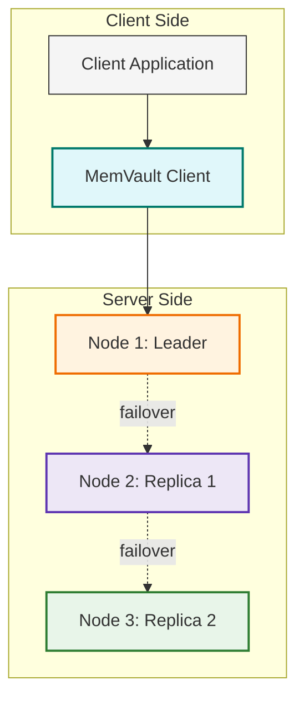

# 🧠 MemVault

A fault-tolerant, distributed in-memory key-value store — built as a Redis-inspired cache from scratch with **Node.js + TypeScript**. Designed for speed, replication, and survivability.

---

## 🚀 Features

### 🧰 Core Commands

| Command | Description |
|--------|-------------|
| `GET <key>` | Fetch the value by key |
| `SET <key> <value> EX <ttl>` | Set or update a key with an optional TTL in seconds |
| `DEL <key>` | Delete a key-value pair from the cache |

- TTL is lazily evaluated during GET (not proactively expired).
- Values are JSON-safe stringified with escape handling.

### ⚙️ Internals

- **In-memory LRU Cache**
  Backed by a **Doubly Linked List + Hash Map** combo for O(1) access.

- **Consistent Hashing (AVL Tree)**
  Nodes are assigned to a **hash ring** using a self-balancing **AVL Tree**.

- **Replication**
  Each key is **replicated to R nodes** (default: `3`). If the leader fails, the next replica becomes the new leader **automatically**.

- **Fault Tolerance**
  Nodes are detected and removed from the ring on socket disconnect. The system routes traffic to the next alive replica.

- **Client-Side Load Balancer**
  Connects to multiple servers and routes commands using the hash ring.

---

## 🏗️ Tech Stack

| Component | Details |
|----------|---------|
| Language | [TypeScript](https://www.typescriptlang.org/) |
| Runtime | [Node.js 22+](https://nodejs.org/) |
| Data Structures | [AVL Tree](https://en.wikipedia.org/wiki/AVL_tree), [LRU Cache](https://en.wikipedia.org/wiki/Cache_replacement_policies#Least_Recently_Used_(LRU)) |
| Deployment | [Docker](https://www.docker.com/) + [Docker Compose](https://docs.docker.com/compose/) |

---

## ⚒️ Setup & Usage

### 📦 Prerequisites

- [Node.js 22+](https://nodejs.org)
- Yarn (`npm i -g yarn@latest`)
- [Docker](https://docker.com)
- Optional: [Postman](https://www.postman.com/) or cURL for API testing

---

### 🔧 Installation

#### 1. Clone the Repo
```bash
git clone https://github.com/ttalpha/memvault.git
cd memvault/
````

#### 2. Build Cache Server Docker Image

```bash
cd cache/
sh build_docker.sh
```

#### 3. Start All Cache Nodes

```bash
docker compose up -d
```

#### 4. Install and Run the Client

```bash
cd ../client/
yarn
yarn build
yarn start
```

---

### 📡 Test Endpoints (via HTTP)

Server runs at `http://localhost:3000`

| Method   | Route       | Description                             |
| -------- | ----------- | --------------------------------------- |
| `GET`    | `/user/:id` | Fetch user from cache or slow source    |
| `PUT`    | `/user/:id` | Update user in slow source and MemVault |
| `DELETE` | `/user/:id` | Delete user from both sources           |

---

## 🧪 Running Tests

### Cache Server

```bash
cd cache/
yarn
yarn test
```

### Client

```bash
cd client/
yarn
yarn test
```

---

## 📘 Architecture Overview



* Client calculates a hash index using consistent hashing (AVL Tree).
* Commands are sent to the leader and replicated to followers.
* TTL is handled lazily at access time.
* If a node dies, the next replica seamlessly takes over.
---

## ✅ Completed Milestones

* [x] GET / SET / DEL command protocol
* [x] JSON-safe value escaping and parsing
* [x] LRU eviction policy
* [x] Lazy expiration with TTL
* [x] Consistent hashing via AVL Tree
* [x] Replication with automatic failover
* [x] Basic retry on reconnect
* [x] Logging improvements with `chalk`
* [x] Tests on data structures

---

## 🧠 Design Philosophy

This project is designed to emulate how **real-world caches like Redis Cluster or DynamoDB** handle:

* Node failures
* Data distribution
* Replication
* Eviction policies

It intentionally avoids heavy protocols like Raft or Paxos in favor of simplicity and reliability through **replication + consistent hashing**.

---

## 📜 License
MIT license [@ttalpha](https://github.com/ttalpha)